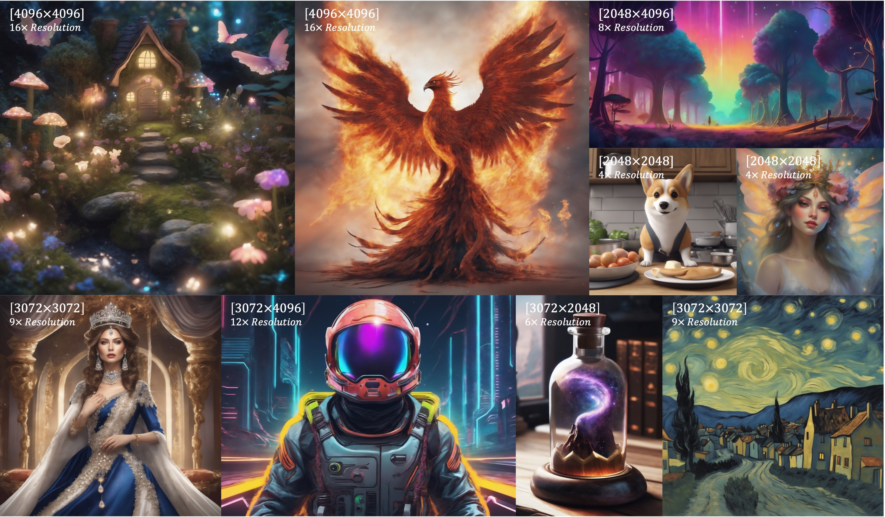

# DiffuseHigh: Training-free Progressive High-Resolution Image Synthesis through Structure Guidance

[](https://yhyun225.github.io/DiffuseHigh/)
[](https://arxiv.org/abs/2406.18459)

Official github for "DiffuseHigh: Training-free Progressive High-Resolution Image Synthesis through Structure Guidance"



## 🚨 News
- **2024.08.28**: *DiffuseHigh* code release!
- **2024.10.22**: Thank [blepping](https://github.com/blepping) for implementing ComfyUI version of *DiffuseHigh* with further improvements. Follow the instructions on [here](https://github.com/blepping/comfyui_jankdiffusehigh) to give it a try.
- **2024.12.09**: *DiffuseHigh* accepted to [AAAI 2025](https://aaai.org/conference/aaai/aaai-25/)!

## 🗓️ To Do List
- [x] Code release for DiffuseHigh
- [ ] DiffuseHigh + ControlNet
- [ ] DiffuseHigh + SVD

## ✏️ Abstract
Large-scale generative models, such as text-to-image diffusion models, have garnered widespread attention across diverse domains due to their creative and high-fidelity image generation. Nonetheless, existing large-scale diffusion models are confined to generating images of up to 1K resolution, which is far from meeting the demands of contemporary commercial applications. Directly sampling higher-resolution images often yields results marred by artifacts such as object repetition and distorted shapes. Addressing the aforementioned issues typically necessitates training or fine-tuning models on higher-resolution datasets. However, this poses a formidable challenge due to the difficulty in collecting large-scale high-resolution images and substantial computational resources. While several preceding works have proposed alternatives to bypass the cumbersome training process, they often fail to produce convincing results. In this work, we probe the generative ability of diffusion models at higher resolution beyond their original capability and propose a novel progressive approach that fully utilizes generated low-resolution images to guide the generation of higher-resolution images. Our method obviates the need for additional training or fine-tuning which significantly lowers the burden of computational costs. Extensive experiments and results validate the efficiency and efficacy of our method.

## ⚙️ Dependency Setup
Create the conda environment with below commands.
Our code is implemented based on torch + diffusers.
You should first check your cuda compiler version, and install the compatible torch.

We ran our experiment with torch 2.1.1 + cuda 12.1.

```Shell
conda create -n diffusehigh python=3.9.0 -y
conda activate diffusehigh
pip install torch==2.1.1 torchvision==0.16.1 torchaudio==2.1.1 xformers --index-url https://download.pytorch.org/whl/cu121
```
(It is cubersome to search the compatible 'xformers' with your current torch. You can simply add 'xformers' in your torch installation command like above.)

You can manually install below pacakges in your environment:

- diffusers >= 0.24.0
- accelerate
- transformers
- pywavelets
- pytorch-wavelets

or automatically install via following command:
```
pip install -r requirements.txt
```

## 🔥 Run DiffuseHigh + SDXL!
### HyperParameters
- `target_height` (type: `List[int]` or `int`, default: `[2048, 3072, 4096]`): The height of the image being generated. If list is given, the pipeline generates corresponding intermediate resolution images in a progressive manner.
- `target_width` (type: `List[int]` or `int`, default: `[2048, 3072, 4096]`): The width of the image being generated. If list is given, the pipeline generates corresponding intermediate resolution images in a progressive manner.
- `guidance_image` (type: `torch.FloatTensor` or `PIL.Image.Image` or `np.ndarray`, default: `None`): If the guidance image is given, *DiffuseHigh* pipeline obtains structure properties from the given image, and generates desired high-resolution image.
- `noising_steps` (type: `int`, default: `15`): The number of noising steps being used in *DiffuseHigh* pipeline.
- `enable_dwt` (type: `bool`, default: `True`): Whether to use DWT-based structural guidance.
- `dwt_steps` (type: `int`, default: `5`): The number of structural guidance steps during the denoising process. Typically, we found that 5 ~ 7 steps works well.
- `dwt_level` (type: `int`, default: `1`): The DWT level of our proposed structural guidance.
- `dwt_wave` (type: `str`, default: `'db4'`): Which wavelet to use for the DWT.
- `dwt_mode` (type: `str`, default: `'symmetric'`): Padding scheme for the DWT.
- `enable_sharpening` (type: `bool`, default: `True`): Whether to use sharpening operation in *DiffuseHigh* pipeline.
- `sharpening_kernel_size` (type: `int`, default: `3`): Kernel size for the Gaussian blur involved in sharpening operation.
- `sharpening_simga` (type: `tuple` or `float`, default: `(0.1, 2.0)`): Standard deviation to be used for creating kernel to perform blurring. If float, sigma is fixed. If it is tuple of float (min, max), sigma is chosen uniformly at random to lie in the given range.
- `sharpening_alpha` (type: `float`, default: `1.0`): The sharpeness factor for controling the strength of the sharpening operation.

### How to use
You can easily import the DiffuseHighSDXLPipeline from our provided code below.

For example, you can generate 2K image via below code.
```Python
from pipeline_diffusehigh_sdxl import DiffuseHighSDXLPipeline
pipeline = DiffuseHighSDXLPipeline.from_pretrained(
        "stabilityai/stable-diffusion-xl-base-1.0", torch_dtype=torch.float16,
).to("cuda")

negative_prompt = "blurry, ugly, duplicate, poorly drawn, deformed, mosaic"
prompt = "A baby bunny sitting on a stack of pancakes."

image = pipeline(
        prompt,
        negative_prompt=negative_prompt,
        target_height=[1536, 2048],
        target_width=[1536, 2048],
        enable_dwt=True,
        dwt_steps=5,
        enable_sharpening=True,
        sharpness_factor=1.0,
    ).images[0]

image.save("sample_bunny_2K.png")
```
result:


For 4K image generation, try below code!
```Python
from pipeline_diffusehigh_sdxl import DiffuseHighSDXLPipeline
pipeline = DiffuseHighSDXLPipeline.from_pretrained(
        "stabilityai/stable-diffusion-xl-base-1.0", torch_dtype=torch.float16,
).to("cuda")

negative_prompt = "blurry, ugly, duplicate, poorly drawn, deformed, mosaic"
prompt = "Cinematic photo of delicious chocolate icecream."

image = pipeline(
        prompt,
        negative_prompt=negative_prompt,
        target_height=[2048, 3072, 4096],
        target_width=[2048, 3072, 4096],
        enable_dwt=True,
        dwt_steps=5,
        enable_sharpening=True,
        sharpness_factor=1.0,
    ).images[0]

image.save("sample_icecream_4K.png")
```

result:


Also try with "DSLR shot of" or "Photorealistic picture of" -based prompts for photorealistic samples!
```Python
from pipeline_diffusehigh_sdxl import DiffuseHighSDXLPipeline
pipeline = DiffuseHighSDXLPipeline.from_pretrained(
        "stabilityai/stable-diffusion-xl-base-1.0", torch_dtype=torch.float16,
).to("cuda")

negative_prompt = "blurry, ugly, duplicate, poorly drawn, deformed, mosaic"
prompt = "A DSLR shot of fresh strawberries in a ceramic bowl, with tiny water droplets on the fruit, highly detailed, sharp focus, photo-realistic, 8K."

image = pipeline(
        prompt,
        negative_prompt=negative_prompt,
        target_height=[2048, 3072, 4096],
        target_width=[2048, 3072, 4096],
        enable_dwt=True,
        dwt_steps=5,
        enable_sharpening=True,
        sharpness_factor=1.0,
    ).images[0]

image.save("sample_DSLR_strawberry_4K.png")
```

result:


If the result image has undesirable structural properties, you can adjust `dwt_steps` argument to little more higher value, e.g., `dwt_steps=7`. If the result image still seems blurry, try higher `sharpness_factor` argument value, e.g., `sharpness_factor=2.0`.